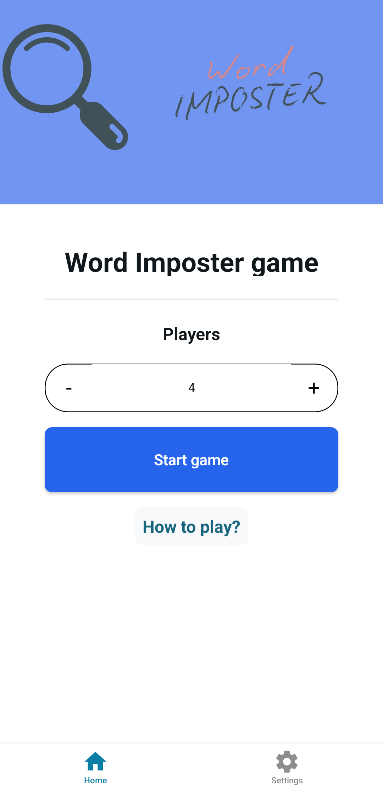
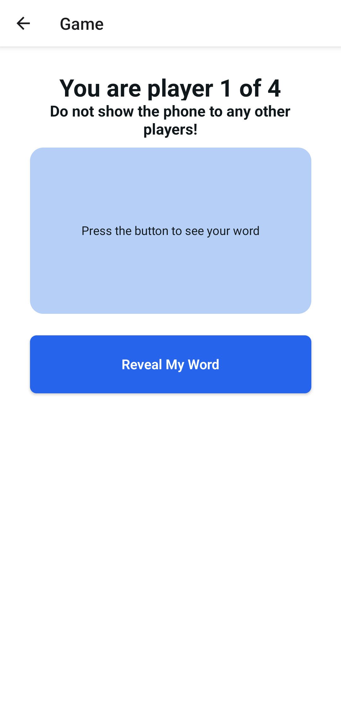
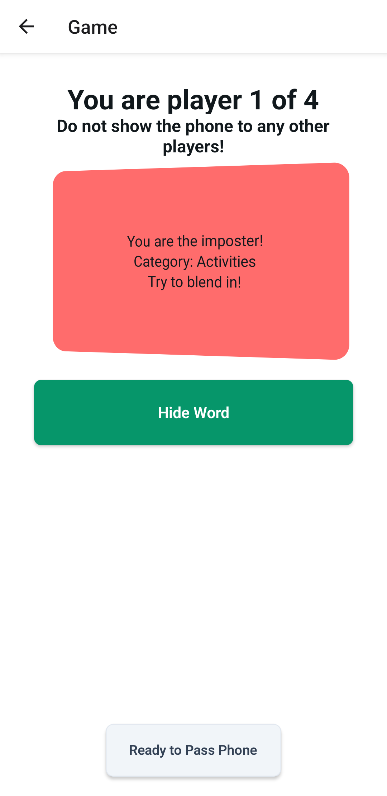
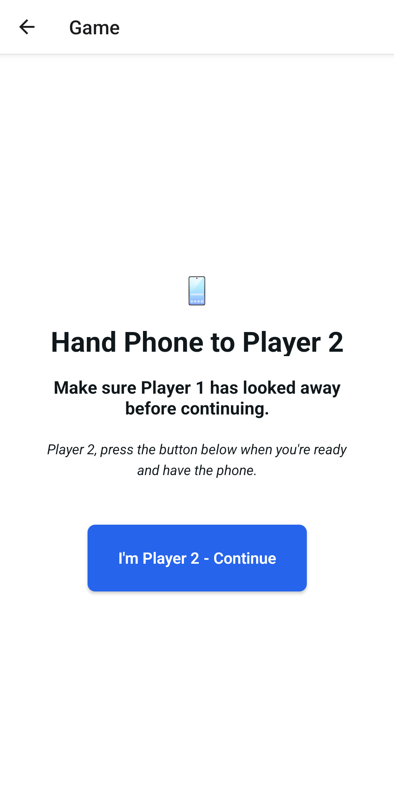
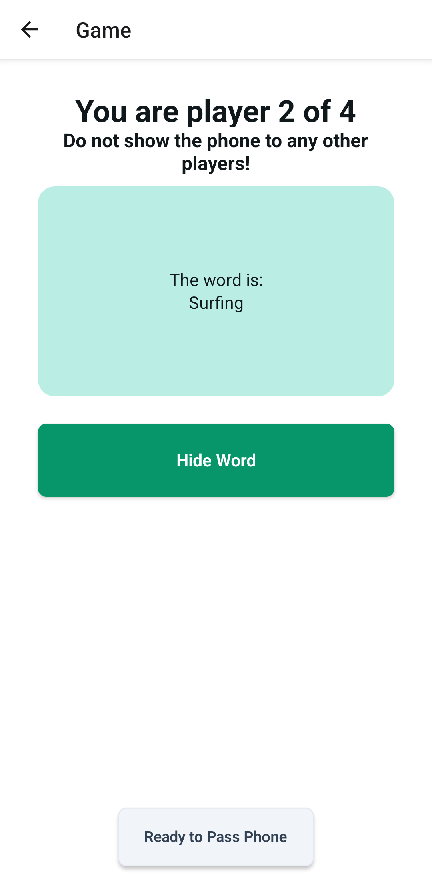
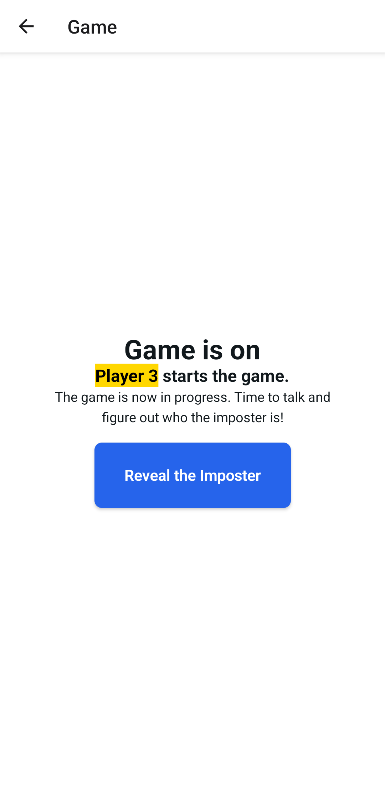
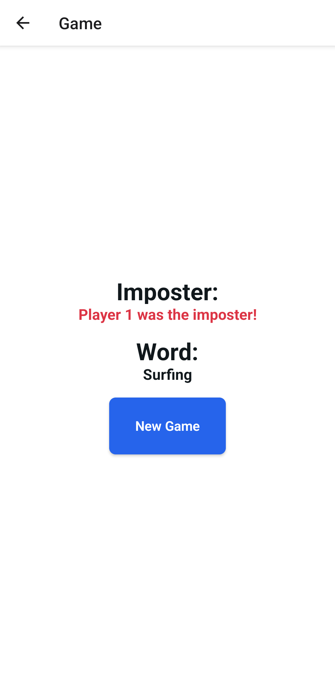
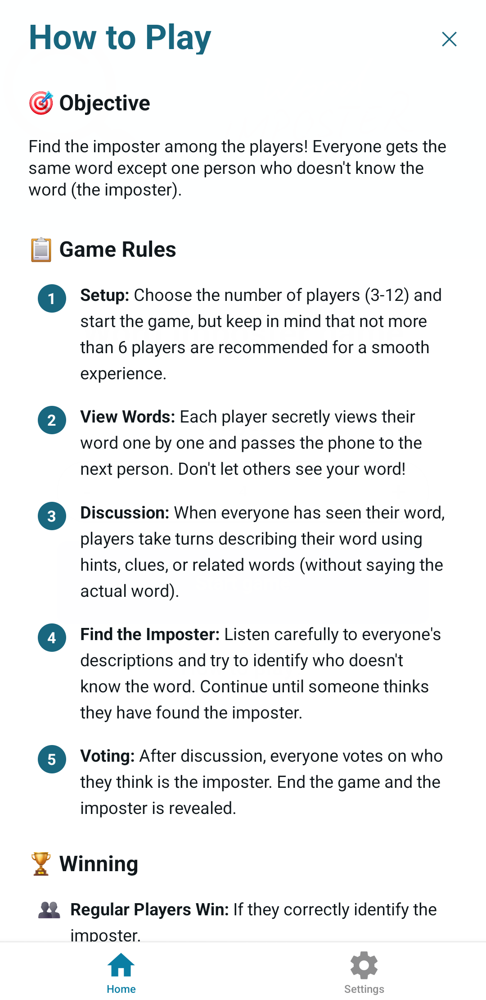
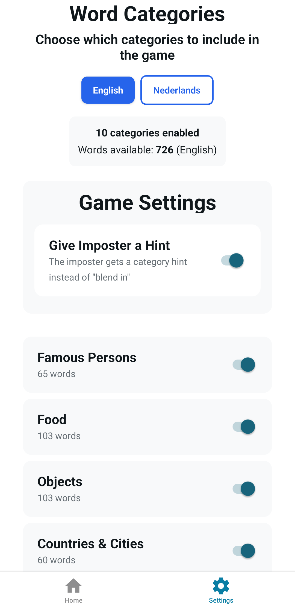
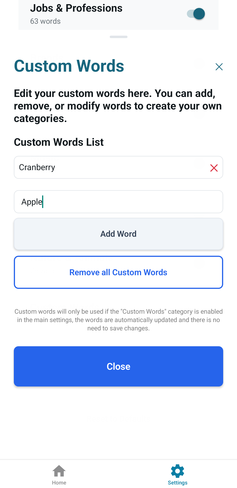

# Word Imposter

Inspired by videos on TikTok I made an app that makes it easier to play Word-Imposter

## How to Play

### 🎯 Objective
Find the imposter among the players! Everyone gets the same word except one person who doesn't know the word (the imposter).

### 📋 Game Rules

1. **Setup:** Choose the number of players (3-12) and start the game. For a smooth experience, not more than 6 players are recommended.
2. **View Words:** Each player secretly views their word one by one and passes the phone to the next person. Don't let others see your word!
3. **Discussion:** When everyone has seen their word, players take turns describing their word using hints, clues, or related words (without saying the actual word).
4. **Find the Imposter:** Listen carefully to everyone's descriptions and try to identify who doesn't know the word. Continue until someone thinks they have found the imposter.
5. **Voting:** After discussion, everyone votes on who they think is the imposter. End the game and the imposter is revealed.

### 🏆 Winning

- 👥 **Regular Players Win:** If they correctly identify the imposter.
- 🕵️ **Imposter Wins:** If they avoid being detected and players vote incorrectly.

---

**💡 Tips**
- **For Regulars:** Give specific but not too obvious clues, or else the imposter might find out the real word!
- **For Imposters:** Listen carefully and give vague, general descriptions.
- **For Everyone:** Pay attention to who gives suspicious or off-topic clues.

---

## 📱 App Screenshots

  
  
  

  
  
  

  

  
   
  

